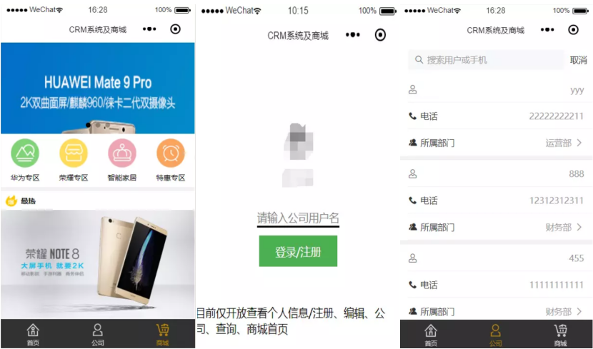
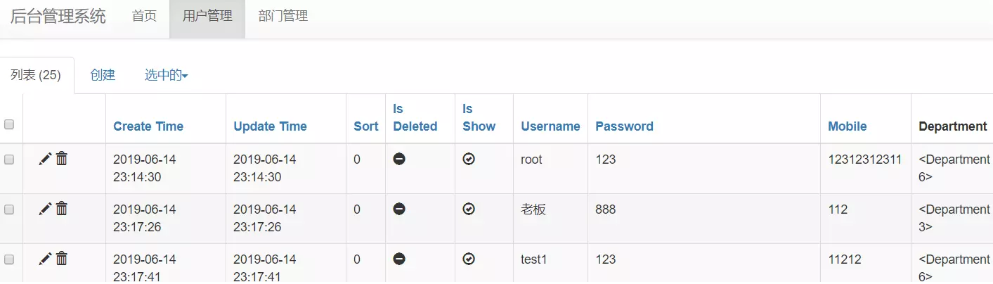
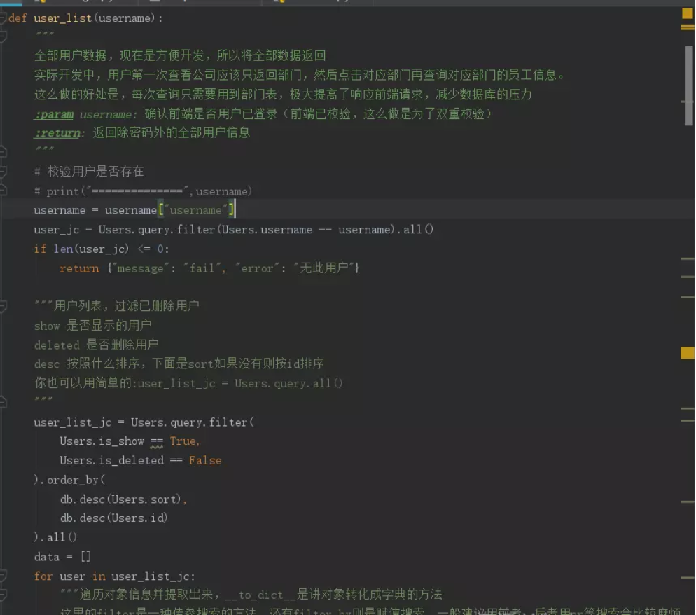

# wechat-app

CRM系统and我的商城，里面大部分代码功能都有注释（小白级），旨在帮助更多人更快的开发flask+微信小程序。员工管理系统及我的个性化商城，超轻量级入门flaks和微信小程序。

## 项目截图：

### 关于代码：

- 小程序前端：对应着前端页面，小程序只有window（mac）版的
- flask_window10：开发时，是在window端开发的，因为小程序也是win端，所以这样开发速度较快

- flask_ubuntu：过度版，从win过度到centos，因为win和centos的环境相差太远，而centos不好调试
- flask_centos7：对应服务器部署上线的后端

#### 部署环境要求

    Centos7+
    Nginx
    python3+
    pymysql/MySQL5.1+
关于配置环境、知识等可以移步到我的博客https://www.cnblogs.com/Benjas/articles/11037450.html

#### 答疑：

1. 应大家需求：把小程序的后台管理数据/仅cengtos部署版本，实现代码在博客，超简单（利用flask-admin开发出来[可增删改]，能够显示数据，小白级。
2. 新增功能销售顾客板块、会议室、商城购物车(参考之前做的一个小程序项目做的)，代码未开放。
3. 有人提到关于框架问题，对于小程序而言，后端更推荐使用sanic框架，但是小程序没有linux版，sanic在window方面的支持又比较差，如果想要更好的性能，可以使用sanic后端+uni-app前端
4. 博客更新了用uwsgi+supervisor来代替runserver的方法。

本专题并不用于商业用途，转载请注明本专题地址，如有侵权，请务必邮件通知作者。

本人水平有限，代码搬到外部环境难免有遗漏错误的地方，望不吝赐教，万分感谢。

Email：909336740@qq.com

